# 🎟️ Flutter Ticket Custom Clipper

A Flutter project demonstrating optimized techniques for creating custom concave shape widget with natural shadow effects, e.g. ticket shape.

This project helps Flutter developers understand and implement performance-optimized custom shapes using `CustomPainter` and `CustomClipper`, with precise shadow alignment for concave shape.

For standard shapes like circles or rounded rectangles, use built-in solutions such as `BoxShadow` or `PhysicalModel` instead of these custom implementations.

 
## 🛠️ Solutions Overview

| Preview | Solution                           | Description |
| ---------- | ------------------------------ | ----------------------------------------------------------- |
|  | **#1 Painter Only with drawShadow()**     | Draws shape and shadow using `CustomPainter` with `canvas.drawShadow()`. Best-Optimized for basic shadows with limited customizations(color, elevation, and transparency). For image background clipping, use Solution 4. More Details: [SolutionOneTicket](lib/widgets/solution_one_ticket.dart#L4)|
|  | **#2 PhysicalShape + Clipper**    | Uses `PhysicalShape` with `CustomClipper` to create a concave shape with basic shadow. Offers minimal code with limited shadow color and elevation customization. Less optimized than Solution 1, but still efficient. More Details: [SolutionTwoTicket](lib/widgets/solution_two_ticket.dart#L4)|
|  | **#3 Painter + Custom Shadow**    | Uses `CustomPainter` to draw shape & custom shadow effects, such as blurry effect or more precise shadow position. Extra computation for manually drawing shadow effects using `canvas.drawPath()`, especially the blur effect. Ideal for complex shadows when performance is secondary. More Details: [SolutionThreeTicket](lib/widgets/solution_three_ticket.dart#L4)|
|  | **#4 Stack: Painter + Clipper**   | Combines `Stack`, `CustomPainter`, and `CustomClipper` to create a ticket shape with image background support. Uses performance-optimized `canvas.drawShadow()` with basic color and elevation customization. Support image background clipping. More Details: [SolutionFourTicket](lib/widgets/solution_four_ticket.dart#L4)|
|  | **#5 Clipper Only (EvenOdd)**     | No shadow support but image background clipping.. Uses `CustomClipper` with `PathFillType.evenOdd` for minimal shape clipping. Most optimized solution when shadows are  More Details: [SolutionFiveTicket](lib/widgets/solution_five_ticket.dart#L4)|
|  | **#6 Animated Painter + Clipper** | Implements animated shadow on hover using `Stack`, `CustomPainter`, `CustomClipper`, and `TweenAnimationBuilder`. Dynamically adjusts shadow opacity and blur with `canvas.drawPath()`. ⚠️ Note: Blur effects can be computationally expensive. More Details: [SolutionSixAnimatedTicket](lib/widgets/solution_six_animated_ticket.dart#L6)|

## 🔍 How to Choose the Right Solution?

```mermaid
flowchart TD
    A["Choose the right solution for concave / convex shape widget"] --> B{"💡 Do you need a shadow?"}
    B -->|❌ No| E["Solution 5: Clipper Only (Supports Image Background)"]
    B -->|✅ Yes| C{"🎨 Do you need a custom shadow?"}
    
    C -->|❌ No| F{"⚙️ Do you prefer minimal code more than most optimized performance?"}
    F -->|✅ Yes| G["Solution 2: PhysicalShape + Clipper (Not as optimized as Solution 1 but still efficient)"]
    F -->|❌ No| H["Solution 1: Painter + drawShadow()"]
    
    C -->|✅ Yes| I{"🌟 Do you need advanced shadow customization? (e.g., blur, position)"}
    I -->|❌ No| J["Solution 3: Painter + Custom Shadow"]
    I -->|✅ Yes| K{"🖼️ Do you need image background support?"}
    
    K -->|✅ Yes| L{"✨ Do you need an animated shadow?"}
    L -->|✅ Yes| M["Solution 6: Animated Painter + Clipper"]
    L -->|❌ No| N["Solution 4: Stack: Painter + Clipper"]
    
    K -->|❌ No| O["Solution 3: Painter + Custom Shadow"]
```



## 📊 Solution Comparison

| Feature                   | #1 Painter + drawShadow() | #2 PhysicalShape + Clipper   | #3 Painter + Custom Shadow | #4 Stack: Painter + Clipper                              | #5 Clipper Only (EvenOdd) | #6 Animated Painter + Clipper |
| ------------------------- | ---------------------- | ------------------------ | ----------------------- | ----------------------------------------------------- | ---------------------- | -------------------------- |
| **Shadow Accuracy**       | ✅ Good                 | ✅ Good        | ✅ Highly Customizable   | ✅ Good                                                       | ❌ No Shadow            | ✅ Animated               |
| **Image Background**      | ❌ Missing a Clipper    | ❌ Clipper only for shadow | ❌ Missing a Clipper | ✅ Supported                                          | ✅ Supported            | ✅ Supported              |
| **Rendering Performance** | ✅ Most Optimized       | ✅ Optimized              | ⚠️ Medium (Requires Blur) | ✅ Optimized                                       | ✅ Most Optimized       | ⚠️ Slightly Lower (Animation Cost)          |
| **Best Use Case**         | Basic shadow needs      | Basic shadow needs and prefer minimal code | Custom shadow effects | Both shadow and image background needs | No shadow needed      | Animated shadow effect    |

## ❗ Best Practices for Using RepaintBoundary
Since `CustomPaint` and `ClipPath` are used in the ticket solutions, wrapping them with `RepaintBoundary` in **Certain Situations** can prevent unnecessary repaints and improve performance. **Use `RepaintBoundary` sparingly**, as overuse can increase memory usage and add complexity to the layer tree.  

You should wrap `CustomPaint` or `ClipPath` with `RepaintBoundary` when:  
1. The widget itself animates or updates frequently, and you want to prevent these repaints from affecting parent widgets.  
2. The widget is expensive to paint, reducing the cost of unnecessary repaints.  
3. It has a child widget that animates or updates frequently, while the `CustomPaint` or `ClipPath` itself remains stable.  
4. It has a parent widget that animates or updates frequently, but the `CustomPaint` or `ClipPath` itself does not need to repaint.  

There is a **trade-off** between FPS (frames per second) and memory usage, so it's important to profile your app to ensure that adding `RepaintBoundary` provides tangible benefits without introducing unnecessary complexity.

## 🚀 Get Started

```sh
git clone https://github.com/emmawong/flutter_ticket_custom_clipper.git
cd flutter_ticket_custom_clipper
flutter pub get
flutter run
```

## 🧪 Run Tests

To run the tests for this project, use the following command:
```sh
flutter test
```
To update the golden files after making changes to the widgets, use:
```sh
flutter test --update-goldens
``` 


## 💻 Project Environment

- **Flutter Version**: 3.29.0
- **Dart Version**: 3.7.0
 


## 🤝 Contributing

Pull requests are welcome! If you find a bug or have a suggestion, please open an issue.


## 📝 Acknowledgments

This project was inspired by a Flutter Study Group workshop I hosted on September 19, 2023, as part of a local developers' meetup organized by [Google Developer Group Hong Kong](https://gdg.community.dev/events/details/google-gdg-hong-kong-presents-flutter-study-group-8-code-challenge-customclipper-and-shadow-cantonese/). The workshop explored CustomClipper and shadow effects in Flutter.

- Workshop repository: [custom_shaped_widget_with_shadow](https://github.com/GDGHongKong/Flutter-Study-Group/tree/main/code_challenge/custom_shaped_widget_with_shadow)

Additionally, some solutions in this project were inspired by the following repositories:

- [flutter-customclip-ticket](https://github.com/VansonLeung/flutter-customclip-ticket.git) by VansonLeung
- [Flutter Custom Tickets using ClipPath](https://gist.github.com/RohmanBenyRiyanto/9db6e06d580481b44e67168905d5964f) by RohmanBenyRiyanto
